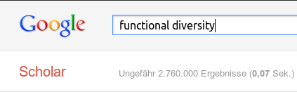
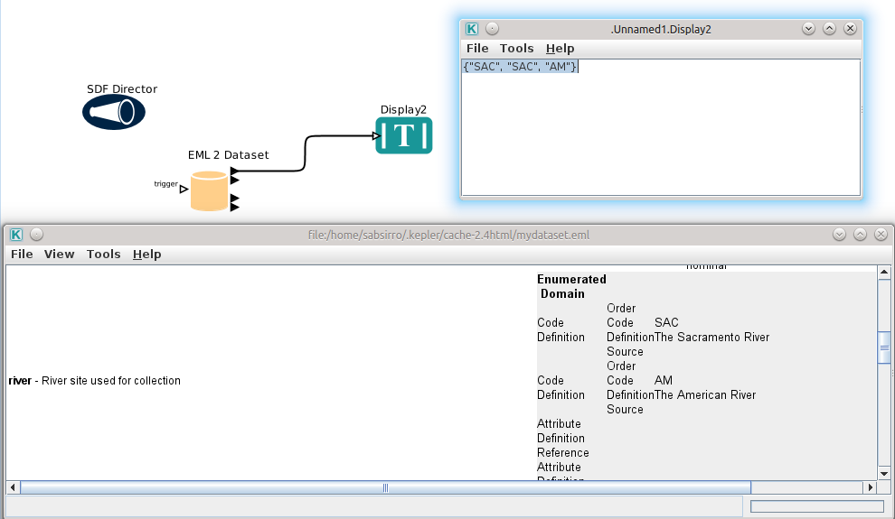
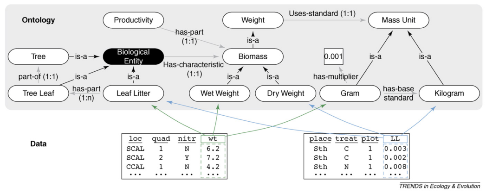
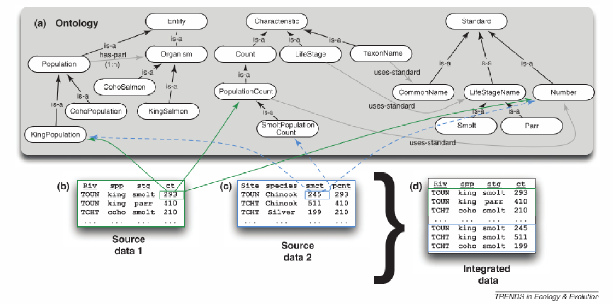

## Background (general)
</br>
</br>
* Ecology
  - collaborative
  - cross-disciplinary 
  - data intensive
  - syntheses
  - complex questions
  - spanning large scales (space/time)

---

## Background (problems)
</br>

- find relevant data
- 
- lack of metadata (new tools/no benefit)
- variability in terminology (homonyms)
  - 163 diffrent useages of stability
  - categorized to 70 concepts

> Grimm et al. 1996

---

## Background (solutions?)

* What do we need?
</br>
* Deep integration of metadata
  - Widely accepted tools (R)
  - Make it unobtrusive
  - Derive automatically (BEFdata thesaurus)
  
* standards (vocabularies)
  - e.g Thesauri/Ontologies?
  - exploration 
  - interpretation
  - integration

---

## Metadata and Thesauri

* At rOpenSci (http://ropensci.org/)
  - metadata integration (R)
  - Ecological Metadata Language (Standard)

* What it can do by now (e.g.)
  - read and write metadata
  - assist metatada creation (console, shiny)
  - publish to KNB, Figshare (data repositories)
 
 

---

## Metadata and Thesauri


```r
dat = data.set(river = c("SAC",  "SAC",   "AM"),
               spp   = c("king",  "king", "ccho"),
               stg   = c("smolt", "parr", "smolt"),
               ct    = c(293,    410,    210),
               col.defs = c("River site used for collection",
                            "Species common name",
                            "Life Stage", 
                            "count of live fish in traps"),
               unit.defs = list(c(SAC = "The Sacramento River", 
                                  AM = "The American River"),
                                c(king = "King Salmon", 
                                  ccho = "Coho Salmon"),
                                c(parr = "third life stage", 
                                  smolt = "fourth life stage"),
                                "number"))
```


https://github.com/ropensci/EML

---

## Metadata and Thesauri


```r
data.frame(dat)
```

```
##   river  spp   stg  ct
## 1   SAC king smolt 293
## 2   SAC king  parr 410
## 3    AM ccho smolt 210
```


```r
attributes(dat)$col.defs
```

```
## [1] "River site used for collection" "Species common name"           
## [3] "Life Stage"                     "count of live fish in traps"
```


---

## Metadata and Thesauri


```r
eml_config(creator="Claas-Thido Pfaff <claas-thido.pfaff@uni-leipzig.de>")
eml_write(dat, file="mydataset.eml", title="My test dataset")
```

```
## [1] "mydataset.eml"
```


* Upper part:


```r
<creator>
  <individualName>
    <givenName>Claas-Thido</givenName>
      <surName>Pfaff</surName>
  </individualName>
  <electronicMailAddress>claas-thido.pfaff@uni-leipzig.de</electronicMailAddress>
</creator> ...
```


---

## Metadata and Thesauri


```r
</physical>
      <attributeList>
        <attribute>
          <attributeName>river</attributeName>
          <attributeDefinition>River site used for collection</attributeDefinition>
          <measurementScale>
            <nominal>
              <nonNumericDomain>
                <enumeratedDomain>
                  <codeDefinition>
                    <code>SAC</code>
                    <definition>The Sacramento River</definition>
                  </codeDefinition>
                  <codeDefinition>
                    <code>AM</code>
                    <definition>The American River</definition>
                  </codeDefinition> ...
```


---

## Metadata and Thesauri

* You can automatically publish your data 
  - figshare (data repo)
  - KNB (data repo)


```r
eml_publish("mydataset.eml", 
            description="Example EML file", 
            categories = "Ecology", 
            tags = "EML", 
            destination="figshare")

[1] 903758
```


* Enhaces your visiblity 
  - your data is citable (DOI), sharable 

---

## Metadata and Thesauri

* Machine readable data (metadata)
  - Inclusion into workflows



* Human readable as well!
  - tools: morpho

--- 

## Metadata and Thesauri

* integration of thesauri
* My thesaurus (tematres)
  - http://tematres.befdata.biow.uni-leipzig.de/vocab/index.php
* Based on keywords (Repos)
  - BEF-China
  - FUN-Div
  - Jena-Experiment
  - Biodiversity Exploratories

---

## Metadata and Thesauri

* I created the `rtematres` package (on CRAN)
  - exploit a vocabulary on tematres
  - Fetch information


```r
rtematres.api.do(task = "fetchVocabularyData")$count_terms
```

```
## [1] "978"
```


* Fetch definition of a term (define/metadata) -> integrate into EML package


```r
rtematres.api.define(term = "plant organ")$description
```

```
## [1] "plant organ - a functional and structural unit of a plant"
```


---

## Metadata and Thesauri

* explore the vocabulary (narrow)


```r
rtematres.api.do(task = "fetchDown", term = "plant organ")$term
```

```
## [1] "branch"        "flower"        "fruit"         "inflorescence"
## [5] "leaf"          "seed"          "twig"
```


* explore the vocabulary (broader) 


```r
rtematres.api.do(task = "fetchUp", term = "plant organ")$term
```

```
## [1] "entity"      "eukaryotes"  "plant"       "plant part"  "plant organ"
```


> Claas-Thido Pfaff, Karin Nadrowski, Anne Lang (rbefdata, in prep)

---

## Metadata and Thesauri

* With rtematres querry BEF-China database (rbefdata on CRAN)


```r
datasets = bef.portal.get.datasets.for_keyword("plant organ")
as.character(datasets$title)
```

```
## [1] "Biomass Allometry Equations of Pilot Experiment (SP7)"                                             
## [2] "Carbon (C) and Nitrogen (N) Concentration (Root, Stem, Twig, Leaf) of 8 target species in the CSPs"
## [3] "Traits of ferns and herb species occuring in the CSPs"
```


```r
narrower_terms = rtematres.api.do(task = "fetchDown", term = "plant organ")$term
datasets = bef.portal.get.datasets.for_keyword(narrower_terms)
dim(datasets)
```

```
## [1] 53  2
```


> Claas-Thido Pfaff, Karin Nadrowski, Anne Lang (rbefdata, in prep)

---

## Whats the next step? An ontology!?

* An example ontology fragment
  - Concepts in ellipses
  - Arrows show relations (plus restrictions)


> Advancing ecological research with ontologies (Madin et al. 2008)

---

## Ontologies in ecology?

* An example application
  - starts with semantic annotation
  - improve dataset search (e.g wet weight)



> Advancing ecological research with ontologies (Madin et al. 2008) 

---

## Ontologies in ecology?

* An example application
  - ontology mediated merge of datasets



> Supporting ecology as data intensive science (Michener et al. 2008) 

---

## Whats next? An ontology?

* I thought (bottom up)
  - based on the extracted concepts
  - too much details (~1800 terms)
  - with:
  - locations, units, species, ecosytem structures ...
  
* Thus I switched (top down)
  - focus: Ecosystem goods and services
  - input: inspired by GVMs?
  - extend: by concepts (thesaurus)

---

* A first raw draft (shown partially, Protégé)
  - e.g. biomes, ecosystem states/processes, fluxes
  - Local environmental factors
  - resources
  - human influences ... 


---

## Summary

* Metadata and Standardizations
  - crutial components
  - data driven science
  - Thesauri (already very useful)
  - speak same language
  - reduce redundancy
  
* ontologies allow (if feasable)
  - smart features (search/integration/aggregation)
  - transfer knowledge to decision makers
  - but maybe not feasable (heterogeneity)

---

<div class = "flushcenter">
     <h1>Thanks for your attention!</h1>
     <h3>Questions?</h3>         
</div>
</br>

> ‘Without concepts it is impossible to work scientifically. 
> The price for this, however, is that the concepts determine the
> ways and methods in which we perceive nature. Critical examination
> of the concepts of their field is therefore part and parcel of 
> every scientist’s obligations.
>
> -- *Grimm, V. and Wissel, C. (1997)* --

